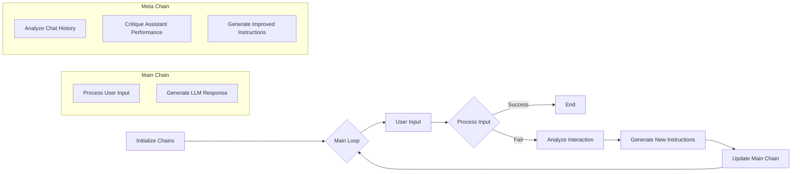

## MetaGemma: Empowering LLMs with Meta-Learning for Enhanced Performance

### Overview
MetaGemma is a Python-based system that utilizes meta-learning to enhance the performance of Large Language Models (LLMs) by iteratively refining instructions based on user interactions. It leverages Langchain and Ollama to manage the LLM chain and access the Gemini 2:2b model, respectively.

### Installation
```bash
pip install langchain langchain_community
```

### Usage
1. **Save** the provided code as `meta_prompt_master.py`.
2. **Run** the script with the desired task:
   ```bash
   python meta_prompt_master.py "Write a poem about a cat"
   ```

### How it Works

The following flowchart illustrates the core components and flow of the MetaPromptMaster system:



### Core Components

* **LLM Chain:** Handles user interactions and generates responses based on the current instructions.
* **Meta Chain:** Analyzes interaction history, provides feedback, and generates improved instructions.
* **Conversation Memory:** Stores conversation history for context preservation.


### Configuration
* **Max iterations:** Control the maximum number of interactions per episode.
* **Max meta iterations:** Determine the maximum number of meta-learning episodes.
* **LLM model:** Specify the LLM model to use (e.g., `gemma2:2b`).
* **Other parameters:** Add additional configuration options as needed.


### Potential Enhancements
* Explore different meta-learning algorithms.
* Implement human-in-the-loop feedback.
* Integrate reinforcement learning for adaptive instruction refinement.

### License
This project is licensed under the MIT License.

